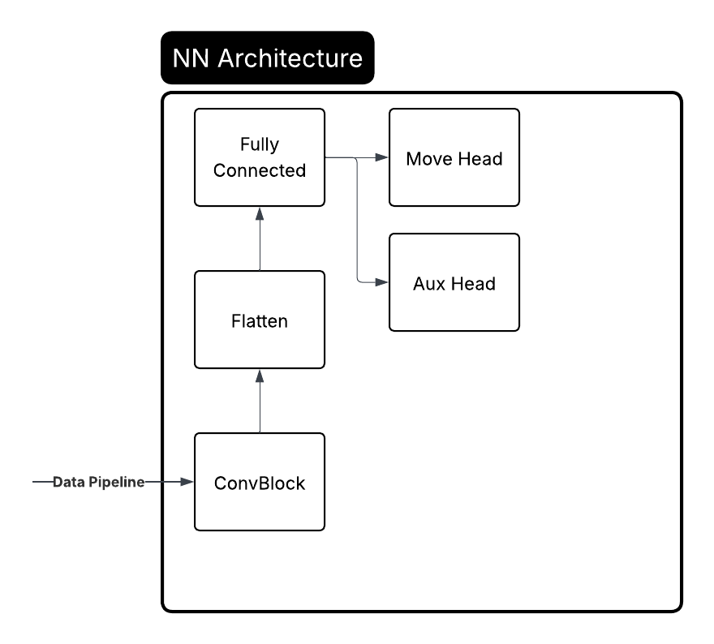

<!-- _class: lead -->

# Creating a Deployable Human-Like Chess Engine to Enhance the Learning Experience

**Ethan Gee & Nate Stott**

---

# Agenda

1. **Introduction & Motivation**
2. **Methodology**
3. **Experiments**
4. **Conclusions & Future Work**

---

# Introduction - Problem Definition

**Maia Problems**
- Traditional chess engines maximize the chances of winning
- Predicting a move a human would play does not mean finding the best move
- **Goal**: Replicate human play

**Rylee Problems**
- Maia requires **large GPUs** to run and train
- Maia can only run on high end machines
- Maia was not trained to play chess openings
- **Goal**: Make a **practical & deployable#** version of Maia

---

# Introduction - Motivation

**Why human aligned AI matters**
- Traditional engines play chess differently making it difficult for humans to learn from
- Attenuating does not **mimic human play**
- Human aligned engines creates more realistic **training partners**
- Example: Chess students can practice with Rylee on their school chromebook to advance their chess skills
- Broader applications: Collaborative decision-making, Education, etc

**How Rylee extends Maia**
- **Edge deployment** Raspberry Pi, Chromebooks
- **Includes openings** first 10 moves
- **No game filtering** include all game types (classical, blitz, etc)
- **Unified model with a higher range** 700-2500 ELO

---

# Methodology - Proposed Solution

We believes we can still maintain similar performance, and add feautures to the MAIA model while signficantly reducing model size.

1. Pull data from Lichess
2. Preprocess games
3. Feed data into NN
4. Predict moves

---

# Methodology - Data Pipeline

- **Download** .zst files from Lichess
- **Extract** PGNs
- **Split** into individual games
- **Convert** to board snapshots
- **Extract** ELO and result metadata
- **Encode** board as 8x8x12 tensors

---

# Methodology - Theories

**Why CNNs work well for chess**
- Chess boards are **spatially related** (knight is better if its in the middle)
- Humans evaluate through pattern recognition
- CNNs excel at **spatial pattern recognition**

**Model size vs performance**
- Increasing model size has exponentially diminishing returns
- We are hoping we can decrease the size of the Maia model while still keeping high accuracy

---

# Methodology - Neural Network

- **Input**: Board(8x8x12) + Metadata(4)
- **Conv Layers**: 6 64x8x8 filters, ReLU
- **Fully Connected**: 4100 -> 512 -> 32
- **Output Heads**: Move (2104) + Auxiliary (2104)
  - 2104 is the number of legal moves
- **Loss**: CrossEntropy (moves) + BCE (valid moves)
- **Optimizer**: Adam
- **Hyperparameter Search**: Random search

---

# Experiments - Dataset

- **Source:** Lichess Open Database
- **Games:** 15,167 human-rated games
- **Snapshots:** 1 million board states
  - including openings
  - including all game types
- **Action Space:** 2,104 legal move classes
- **Time Span:** January 2013

| Split      | Percentage | Snapshots      |
|------------|------------|----------------|
| Training   | 80%        | **800,000**    |
| Validation | 10%        | **100,000**    |
| Test       | 10%        | **100,000**    |

---

# Experiments - Baselines

| Baseline Model            | Description                      |
|-------------------|----------------------------------|
| **Random**        | Random legal move selection      |
| **Random Forest** | Nothing that simple should work that well - Ethan Gee |
| **Stockfish 15**  | Traditional chess engine         |
| **Leela 4200**    | Neural chess engine              |
| **Maia-1 1500**    | Human aligned prediction model   |

---

# Experiments - Architecture

### Small Fully Connected Model
A Small model that had a similar architecture to StockFish
- 8 fully connected layers of 32 neurons

### Convolutional Model 
- Combination of Convolution and fully connected to mirror human cognition

### Convolution with Auxillary Head
- Added an auxillary head that determines legal moves to instill better game understanding

---

# Experiments - Evaluation Metrics

- **Top-1 Accuracy**: Predicted move matches actual human move
- **Top-5 Accuracy**: Actual move in top 5 predictions. This is a good for a more generalizaed alignment.

---

# Experiments - Comparisons

| Method            | Top-1 Accuracy |
|-------------------|----------------|
| **Random**        | **6%**         |
| **Random Forest** | **13%**        |
| **Stockfish 15**  | **40%**        |
| **Leela 4200**    | **44%**        |
| **Maia1 1500**    | **51%**        |
| **Rylee**         | **25%**        |

- Rylee has 800,000 parameters
  - Trained on one Raspberry pi
- Maia has 25 million parameters
  - Trained on two A100 80Gb GPUs

- Rylee has 800,000 parameters vs MAIAs 25 Million
- No filtering by game type (classical, blitz, etc) to capture broader human play patterns
- We include games with mixed skill levels to better reflect general human behavior
- 15,000 games vs. Maia’s 169 million games
- MAIA was Trained on two A100 80Gb GPUs vs Rylee being trained on a Edge Device

---

# Conclusions - Discussions

| Metric          | Training | Validation |
|-----------------|----------|------------|
| **Loss**        | 0.0152   | 0.0164     |
| **Top-1 Accuracy** | 28%    | 25%      |
| **Top-5 Accuracy** | 53%    | 51%      |

- Strong generalization between training and validation metrics
- Model captures key human decision-making patterns
- Rylee required around 1.5 hours of preprocessing and 2-3 days of training

- Maia required 8 days of preprocessing and 3-4 weeks of training

---

# Conclusions - Future Work

**Model Improvements**
- Add data augmentation (board flips and rotations) to improve robustness
- Time parameter to better address time based decision making

**Additional Features**
- **ELO Prediction:** Estimate player rating from move patterns to quickly adapt to player skill
- **Human vs Bot Discriminator:** Detect engine-like play
- **Blunder Detection:** Identify major mistakes for analysis

---

# References

**Primary Works**
- McIlroy-Young et al. (2020). "Aligning Superhuman AI with Human Behavior: Chess as a Model System." KDD 2020.
- Tang et al. (2024). "Maia-2: A Unified Model for Human-AI Alignment in Chess." NeurIPS 2024.
- McIlroy-Young et al. (2021). "Detecting Individual Decision-Making Style: Exploring Behavioral Stylometry in Chess." NeurIPS 2021.

**Data & Tools**
- Lichess Open Database: https://database.lichess.org/
- Stockfish Chess Engine: https://stockfishchess.org/
- Leela Chess Zero: https://lczero.org/
- Maia Chess Project: https://maiachess.com/
- PyTorch (Paszke et al., 2019): https://pytorch.org/
- python-chess library (Moskopp, 2014): https://github.com/niklasf/python-chess

---

<!-- _class: lead -->

# Questions?

**Rylee**: Human-Like Chess Engine

Ethan Gee & Nate Stott
